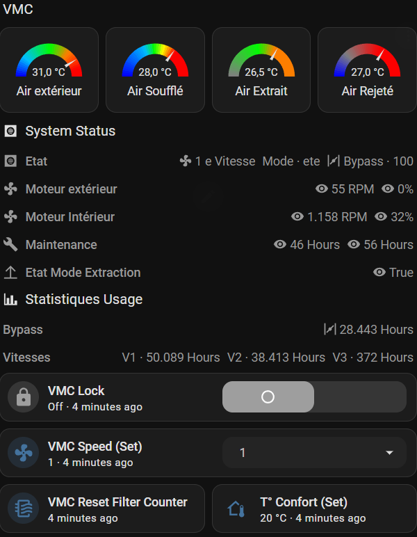

# raspVMC (hardened, simplified fork)

> **Status: not fully field-tested yet.** The bug fixes and architecture
> change described below are based on careful analysis (see
> `docs/TROUBLESHOOTING.md`) and worked in initial testing, but this fork is
> currently running its first extended real-world validation (one WHR960 +
> Raspberry Pi setup). Treat it as "should work, not yet proven over weeks of
> uptime" until this notice is removed. Feedback and issues welcome.

This is a fork of [jcoenencom/raspVMC](https://github.com/jcoenencom/raspVMC) -
all credit for the original protocol implementation, server/CGI architecture
and web UI goes to that project. This fork exists because a long-running
deployment (Zehnder/StorkAir WHR960, Raspberry Pi, Home Assistant) kept
freezing for reasons that took a fair amount of debugging to actually pin
down, and because KNX/MySQL/ConfoSense support couldn't be tested by this
fork's maintainer and were dropped rather than carried along untested.

If you need KNX, MySQL, or a ConfoSense/CCEASE bridge, use the upstream
project instead - the wire protocol handling (`VMC.py`) is unchanged and
compatible either way, so patches tend to move between the two easily.



*Example Home Assistant dashboard built from the sensors in
[`home-assistant/configuration.yaml.example`](home-assistant/configuration.yaml.example).*

## What this fork is for

Bridging a Zehnder/StorkAir ComfoAir-family balanced ventilation unit
(WHR930, WHR960, CA350, ...) connected over RS232 to a Raspberry Pi, exposing
it as JSON over HTTP (CGI), for consumption by Home Assistant or anything
else that can poll a URL.

```
Home Assistant --(HTTP, polling)--> CGI scripts --(TCP)--> server.py --(RS232)--> VMC unit
```

Tested on Raspbian Wheezy (yes, that old) with Python 2.7, Apache 2.2 +
mod_cgi, and a WHR960. Should work unmodified on any Debian-family Pi image
old enough to still ship Python 2 by default.

## What changed vs. upstream, and why

- **`server.py` rewritten around upstream's later `(client, frame)` queue
  design** (not the older `sender`/`message_queues` FIFO pairing this fork's
  maintainer had been running for years) - see
  `docs/TROUBLESHOOTING.md` for the actual multi-day debugging story of why
  the old design would occasionally freeze the whole process solid until
  manually killed.
- **ConfoSense/CCEASE bridge, telnet-style control port, KNX and MySQL
  support removed.** None of it could be tested against this fork's changes.
  `VMCknx.py`, `knx.ini`, `config.py` were removed; `install.bash` no longer
  calls the interactive config wizard and ships a ready-to-edit `VMC.ini`
  instead.
- **A heartbeat file** (`[debug] heartbeat` in `VMC.ini`, tmpfs by default -
  zero SD wear) written every 5 seconds, so a future freeze can actually be
  diagnosed instead of guessed at.
- **CGI scripts get a socket timeout** and a catch-all exception handler, so
  a server-side problem fails fast (~5s) with a readable JSON error instead
  of hanging the calling Apache worker for up to an hour.
- **A checksum-validation bug fixed** in `VMC.py`: `Checksum()` returned `-1`
  (which is truthy in Python) on a failed checksum, so corrupted frames were
  silently parsed as if valid.
- **`0xCF` ("set ventilation levels") exposed**, via `setfanlevels()` /
  `setextraction()` in `VMC.py` and `VMCsetExtraction.cgi` - lets you reduce
  supply air independently of exhaust (useful for night cooling). **Read
  `docs/EXTRACTION_MODE.md` before wiring this into any automation** - it
  documents a real gap between this and the unit's own front-panel button
  that matters if you're relying on it as a safety fallback.
- `fix_permissions.sh` added: GUI SFTP clients (WinSCP and friends) commonly
  reset the executable bit on file overwrite, breaking Apache/`init` in a way
  that looks unrelated at first. Run it after every deploy, or configure your
  client to preserve permissions.
- `.gitattributes` added to normalize new commits to LF line endings for
  scripts - some files in this codebase's history had Windows (CRLF) line
  endings, which breaks the shebang line's interpreter lookup on Linux (see
  `docs/TROUBLESHOOTING.md`).

## Installation

### Prerequisites

- A Raspberry Pi (any model with a usable serial port or a USB-serial
  adapter) running a Debian-family OS (Wheezy through current Raspberry Pi
  OS all work - `install.bash` uses `apt-get`).
- The VMC unit's RS232 wired to that serial port (see your unit's manual for
  the connector pinout - typically an RJ45 breakout, 9600 8N1).
- Network access from the Pi to run `apt-get` during install.

### 1. Get the code

```bash
git clone https://github.com/sjauquet/raspVMC.git
cd raspVMC
```

(If you forked this repo yourself, use your own fork's URL instead.)

### 2. Identify your serial device

Before running the installer, find out what your VMC's serial adapter shows
up as:

```bash
ls /dev/tty*
# unplug/replug a USB-serial adapter and diff the output, or check:
dmesg | grep -i tty
```

Common values: `/dev/ttyAMA0` (Pi's built-in UART), `/dev/ttyUSB0` (USB-serial
adapter), `/dev/serial0` (symlink on newer Raspberry Pi OS).

### 3. Run the installer

```bash
chmod +x install.bash
./install.bash
```

This installs `apache2`, `socat`, `python-serial` (and, if you say yes,
`FHEM`), copies `VMC.ini` to `/etc/VMC/VMC.ini` and opens it in `$EDITOR`
(defaults to `nano`) so you can set `[VMC] device=` to whatever you found in
step 2, deploys the CGI scripts to `/usr/lib/cgi-bin/`, copies `server.py` and
`VMC.py`, and adds the `inittab` respawn entry so the server restarts
automatically if it ever exits.

### 4. Alternative: systemd instead of inittab

On Raspberry Pi OS Jessie or later (systemd-based), use the provided unit
file instead of relying on `inittab`:

```bash
sudo cp VMCserver.service /etc/systemd/system/
sudo systemctl daemon-reload
sudo systemctl enable --now VMCserver
```

Edit the `WorkingDirectory`/`ExecStart` paths in `VMCserver.service` first if
you didn't clone into `/home/pi/raspVMC`.

### 5. Permissions

GUI SFTP clients (WinSCP and similar) commonly reset the executable bit when
you overwrite a file, which breaks Apache/`init` silently. Keep the fix
script handy and re-run it after every future file transfer:

```bash
sudo cp fix_permissions.sh /home/pi/
chmod +x /home/pi/fix_permissions.sh
/home/pi/fix_permissions.sh
```

### 6. Verify it's working

```bash
curl http://localhost/cgi-bin/VMCbinjson.cgi
```

This should return a JSON blob with `config`/`data`/`device` keys (fan
speeds, temperatures, usage counters, firmware version, ...). If instead you
get a timeout, a 500 error, or `Connection refused`, start with
`docs/TROUBLESHOOTING.md`.

Also check the heartbeat file is being written (confirms `server.py`'s main
loop is alive and not stuck):

```bash
cat /run/vmc/heartbeat.log
```

## Home Assistant

See `home-assistant/configuration.yaml.example` for a REST sensor + a full
set of template sensors (temperatures, fan speeds/RPM/%, usage counters,
bypass status, extraction-mode monitoring).

## Extraction-only / night cooling mode

`VMCsetExtraction.cgi?state=on|off` and `VMCextractionWatchdog.py` implement
this, but **read `docs/EXTRACTION_MODE.md` first** - there's a real
difference between how this and the physical front-panel button achieve the
same airflow effect, with consequences for what actually happens if your
automation stack goes down while it's active.

## Other docs

- `docs/PROTOCOL.md` - RS232 protocol quick reference and source.
- `docs/TROUBLESHOOTING.md` - the freeze/permissions/CRLF stories in detail.
- `docs/EXTRACTION_MODE.md` - the extraction-mode software-vs-button gap.

## License

GPL-2.0, same as upstream (see `LICENSE`).
